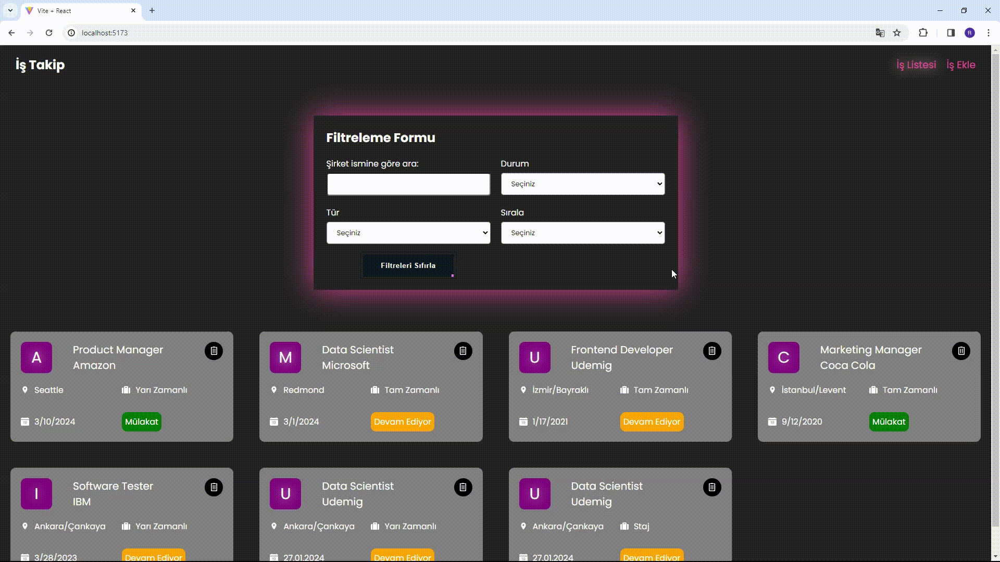

<h1>Job-Project</h1>

Özellikler:

-İş İlanları Listeleme:

Uygulama, bir API üzerinden iş ilanları verilerini çeker ve kullanıcıya iş ilanlarını listeleyen bir sayfa sunar.

-Filtreleme ve Sıralama:

Kullanıcılar, şirket adına, iş durumuna, iş türüne göre arama yapabilir ve iş ilanlarını belirli kriterlere göre filtreleyebilir.
Ayrıca, iş ilanlarını şirket adına göre sıralama seçeneği bulunmaktadır.

-Yeni İş İlanı Ekleme:

Kullanıcılar, yeni bir iş ilanı eklemek için bir form doldurabilir. Bu form, pozisyon, şirket, lokasyon, durum ve tür gibi bilgileri içerir.

-İş İlanı Silme:

Her iş ilanı kartının yanında bulunan silme düğmesi ile kullanıcılar iş ilanlarını silebilirler.
Silme işlemi öncesinde bir onay penceresi görüntülenir.

-Hata Yönetimi:

Uygulama, API çağrıları veya diğer hatalar nedeniyle oluşan hataları kullanıcıya bildirir.
Kullanıcı, hata durumunda tekrar deneme düğmesi aracılığıyla verileri yeniden yükleyebilir.

--Kullanılan Kütüphaneler:

-react-router-dom

-axios

-sass

-react-toastify

-json-server

-react-redux

-@reduxjs/toolkit

-uuid

-react-icons

